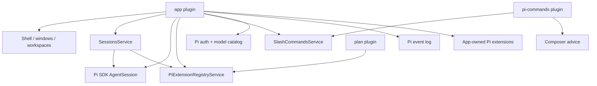
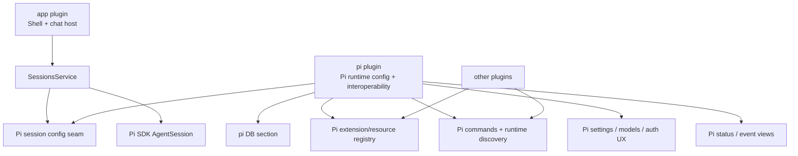

# Pi Plugin Boundary Refactor

## Goal

Create a dedicated required `plugins/pi` plugin that owns Pi runtime configuration, Pi extension metadata, slash-command metadata, and Pi interoperability. Keep `app` focused on shell/chat hosting and live session orchestration for now, but stop adding Pi-specific registries/metadata/UI state to `root.app.*`.

The broadest product goal is first-class Zenbu support for Pi slash commands. The Pi plugin should discover and store all runtime Pi slash commands — extension commands, prompt-template commands, and skill commands — in the Pi plugin database with enough metadata/provenance for UI to group, explain, and safely dispatch them.

This is **not** about replacing Pi with another chat runtime. Pi remains the only runtime. The motivation is cleanliness, locality, and making future Pi features possible through plugin-owned code and plugin-owned DB.

## TODO

### Commit 1 — Add new required Pi plugin skeleton

- [x] Create `plugins/pi/` with `zenbu.plugin.ts`, `package.json`, `tsconfig.json`, `src/main/schema.ts`, `src/main/services/pi-runtime.ts`, and migrations if schema is added.
- [x] Add `plugins/pi/zenbu.plugin.ts` to `zenbu.plugins.jsonc`, enabled by default.
- [x] Add Pi plugin files to `zenbu.config.ts` build includes.
- [x] Define schema for `root.pi.extensions`.
- [x] Generate migrations from inside `plugins/pi` using `cd plugins/pi && pnpm exec zen db generate`.
- [x] Verify typecheck.

### Commit 2 — Implement Pi runtime extension registry + event bus

- [x] Implement `PiRuntimeService` with service key likely `"piRuntime"`.
- [x] Add a shared Pi event bus owned by this service using `createEventBus()`.
- [x] Add `registerExtension(args)` and `unregisterExtension(args)` APIs.
- [x] On service evaluate, clear stale extension rows where `source` is `"plugin"` or `"built-in"`; preserve `"user"` and `"project"` rows.
- [x] `registerExtension` writes `root.pi.extensions[id]` with default `enabled: true` and default `source: "plugin"`.
- [x] `getSessionConfig({ sessionId, scopeId, cwd })` returns enabled extension paths and the shared event bus.
- [x] Add the path-based/event-bus decision comment near this code.
- [x] Verify typecheck.

### Commit 3 — Wire app activation to Pi runtime config

- [x] In `plugins/app/src/main/services/sessions.ts`, add soft string-key runtime access for `ctx.piRuntime`.
- [x] In `plugins/app/src/main/services/sessions/activation.ts`, call `piRuntime.getSessionConfig({ sessionId, scopeId, cwd: scope.directory })`.
- [x] Pass returned `extensionPaths` to `DefaultResourceLoader.additionalExtensionPaths`.
- [x] Pass returned `eventBus` to `DefaultResourceLoader({ eventBus })`.
- [x] Keep existing app-owned `extensionFactories: createAppPiExtensionFactories(...)` temporarily.
- [x] Remove `piExtensionRegistry` dependency and reads from `SessionsService` / activation.
- [x] Add a TODO comment near app-owned factories noting that these Pi built-ins should migrate to `plugins/pi` later.
- [x] Verify typecheck.

### Commit 4 — Migrate `plan` extension registration to Pi plugin

- [x] Update `plugins/plan/src/main/services/plan.ts` to depend on `piRuntime` string key instead of `piExtensionRegistry`.
- [x] Call `piRuntime.registerExtension({ id: "plan", path: PLAN_EXTENSION_PATH, label: "Plan", pluginName: "plan", source: "plugin" })`.
- [x] Unregister via `piRuntime.unregisterExtension({ id: "plan" })`.
- [x] Update comments in `plan.ts` and `plan/zenbu.plugin.ts` to reference the Pi plugin seam.
- [x] Update `plugins/plan/zenbu.plugin.ts` to depend on `pi` as needed for generated types/linking, plus `app` if it still needs app RPC/events.
- [ ] Verify that plan tool still appears in active sessions after reload/new session.
- [x] Verify typecheck.

### Commit 5 — Remove app-owned Pi extension registry

- [x] Delete `plugins/app/src/main/services/pi-extension-registry.ts`.
- [x] Remove `piExtension` schema from `plugins/app/src/main/schema/app.ts` and `plugins/app/src/main/schema/index.ts`.
- [x] Generate app migration to remove `root.app.piExtensions` using `cd plugins/app && pnpm exec zen db generate`.
- [x] Ensure no source references to `piExtensionRegistry` or `root.app.piExtensions` remain.
- [x] Verify typecheck.

### Commit 6 — Runtime slash-command discovery in Pi plugin

- [x] Add Pi plugin DB schema for `runtimeCommands`.
- [x] Add a path-based Pi extension in `plugins/pi/src/extension/runtime-command-sync.ts`.
- [x] Register that extension as a built-in Pi extension from `PiRuntimeService.evaluate()` using the same `registerExtension` API with `source: "built-in"`.
- [x] The extension should call `pi.getCommands()` on `session_start` and `resources_discover`.
- [x] The extension should emit `zenbu-pi:runtime-commands` on the shared Pi event bus with `sessionId: ctx.sessionManager.getSessionId()` and `commands: pi.getCommands()`.
- [x] `PiRuntimeService` should listen to `zenbu-pi:runtime-commands` and write/prune `root.pi.runtimeCommands` for that session.
- [x] Preserve Pi `sourceInfo` exactly.
- [x] Verify typecheck.

### Commit 7 — Expose runtime commands in composer through Pi/plugin-owned UI

- [x] Add `plugins/pi-auto-commands` as the UX plugin for Pi runtime-discovered slash commands.
- [x] Keep command discovery/storage in `plugins/pi` and composer projection in `plugins/pi-auto-commands`.
- [x] Prefer using `plugins/pi` or `plugins/pi-commands` composer advice rather than changing app composer schema.
- [x] Read active session id and `root.pi.runtimeCommands` from plugin DB.
- [x] Add runtime commands to the slash/typeahead UI with grouping/provenance: Pi Extensions, Pi Prompts, Pi Skills.
- [x] Show hint examples like `skill · package` or `prompt · project`.
- [x] If current composer advice cannot augment the slash menu cleanly, add the smallest generic host seam needed. Do not add Pi-specific fields to `root.app.slashCommands`.
- [x] Dispatch selected runtime commands through existing `rpc.app.sessions.prompt({ sessionId, text })` where acceptable.
- [x] If extension commands should not render as user messages, add a narrow app method such as `runRuntimeCommand({ sessionId, text })` that calls `live.pi.prompt(...)` without pre-staging a user prompt event.
- [x] Verify typecheck.
- [ ] Verify interactive slash menu behavior.

### Commit 8 — Optional cleanup / follow-up moves

- [ ] Move app-owned Pi built-in extensions (`bash-timeout`, `zenbu-house-rules`) into `plugins/pi` as built-in registered path extensions if practical.
- [ ] Evaluate moving `pi-event-log` into `plugins/pi`.
- [ ] Evaluate moving Pi settings from `pi-commands` into `plugins/pi`, or keep `pi-commands` as a UX layer over `plugins/pi`.
- [ ] Consider merging `pi-commands` into `plugins/pi` only if the separation becomes unnecessary.

## Progress Notes

- 2026-06-05: Earlier broad app-owned implementation was stashed as `stash@{0}: wip pi runtime slash command bridge`; use only as reference.
- 2026-06-05: Finalized direction: path-based Pi extensions plus Pi-plugin-owned shared event bus; no in-memory factory contributions for now.
- 2026-06-05: Finalized direction: create new required `plugins/pi`; keep `pi-commands` separate initially.

- 2026-06-05: Implemented Pi plugin runtime seam through runtime command composer advice; static typecheck passes via `./node_modules/.bin/tsc --noEmit`.
- 2026-06-05: Reframed the primary goal around first-class Pi slash command support. Added a narrow `app.sessions.runRuntimeCommand` seam so Pi-owned command UI can dispatch through Pi without app pre-staging extension commands as visible user messages.
- 2026-06-05: Split automatic/runtime command UI into `plugins/pi-auto-commands`. The core `pi` plugin now owns discovery + DB rows; `pi-auto-commands` owns composer typeahead projection and dispatch.
- 2026-06-05: Runtime command sync is now also triggered from app session activation and `/reload` after Pi resource loading settles. The Pi lifecycle extension remains useful, but activation/reload is the reliable host seam for populating `root.pi.runtimeCommands`.
- 2026-06-05: Fixed the optional app-to-Pi service lookup to use Zenbu runtime's `runtime.get({ key: "piRuntime" }, ...)` seam. Plain `ctx.piRuntime` is not available unless declared as a hard dep, so command sync was previously a no-op and `root.pi.runtimeCommands` stayed empty.
- 2026-06-05: Fixed `/reload` crash from calling `live.pi.getCommands()`. The SDK exposes `getCommands()` on ExtensionAPI, not AgentSession, so the host sync now reads the currently-bound extension runtime when available and no-ops otherwise.
- 2026-06-05: Increased the composer slash result cap so the runtime Pi command catalog (extension + prompt + skill commands) is not truncated before prompt/skill groups like `handoff` appear.
- 2026-06-05: Switched `pi-auto-commands` from Composer advice to the existing generic app slash-command registry as the UI projection layer. `root.pi.runtimeCommands` remains the source of truth; `root.app.slashCommands` now contains transient Pi Runtime rows so the stable host slash menu renders them reliably.

## Final notes and learnings

### Finalized Decisions

- Create a **new required core plugin**: `plugins/pi`.
- Keep `plugins/pi-commands` separate for the first pass; it can depend on/use `plugins/pi` later.
- Keep live `AgentSession` creation/lifecycle in `app` for now.
- `plugins/pi` provides Pi runtime/session config to `app` through a small string-keyed service seam, likely `ctx.piRuntime`.
- `app` should **not** declare a hard `dependsOn` on `pi`; use a soft string-key lookup with fallback.
- Delete/migrate `app.PiExtensionRegistryService`; no compatibility bridge.
- Migrate first-party plugins, especially `plan`, to register Pi extensions through `plugins/pi`.
- Pi extension contributions are **path-based only** for now.
- Do **not** support in-memory extension factories yet.
- Use a **Pi-plugin-owned shared event bus** for Pi extensions that need to communicate back to Zenbu.
- Store Pi-specific metadata in `root.pi.*`, not `root.app.*`.
- `root.pi.extensions` should be DB-backed immediately.
- On Pi plugin evaluate, wipe/repopulate `source: "plugin" | "built-in"` extension rows; preserve `source: "user" | "project"` for future persisted user/project config.

### Required Reading for Implementing Agent

#### Pi docs

- `/Users/daniel/.zenbu/apps/zenbu/node_modules/.pnpm/@earendil-works+pi-coding-agent@0.78.0_ws@8.21.0_zod@4.4.3/node_modules/@earendil-works/pi-coding-agent/docs/extensions.md`
  - Focus on `DefaultResourceLoader`, `resources_discover`, `pi.getCommands()`, and `pi.events`.
- `/Users/daniel/.zenbu/apps/zenbu/node_modules/.pnpm/@earendil-works+pi-coding-agent@0.78.0_ws@8.21.0_zod@4.4.3/node_modules/@earendil-works/pi-coding-agent/docs/sdk.md`
  - Focus on `DefaultResourceLoader({ eventBus })`, `createEventBus()`, and SDK extension loading.

#### App session/runtime code

- `plugins/app/src/main/services/sessions.ts`
- `plugins/app/src/main/services/sessions/activation.ts`
- `plugins/app/src/main/services/pi-extension-registry.ts`
- `plugins/app/src/main/pi-extensions/index.ts`
- `plugins/app/src/main/pi-extensions/bash-timeout.ts`
- `plugins/app/src/main/pi-extensions/zenbu-house-rules.ts`

#### Existing plugin patterns

- `plugins/plan/src/main/services/plan.ts`
- `plugins/plan/src/extension/index.ts`
- `plugins/pi-commands/src/main/services/pi-commands.ts`
- `plugins/pi-commands/src/content/composer-input-advice.tsx`
- `plugins/pi-commands/zenbu.plugin.ts`
- `plugins/settings/src/main/services/settings-views.ts`

#### Generic registries and schema patterns

- `plugins/app/src/main/services/palette-actions.ts`
- `plugins/app/src/main/services/slash-commands.ts`
- `plugins/app/src/main/schema/app.ts`
- `plugins/app/src/main/schema/index.ts`

#### Plugin config/build inclusion

- `zenbu.plugins.jsonc`
- `zenbu.config.ts`

### Before: current ownership



### After: target ownership



### Proposed Core Types

```ts
import type { EventBus } from "@earendil-works/pi-coding-agent"

type PiRuntimeApi = {
  getSessionConfig(args: {
    sessionId: string
    scopeId: string
    cwd: string
  }): Promise<PiSessionConfig>
}

type PiSessionConfig = {
  extensionPaths: string[]
  eventBus?: EventBus
}
```

Use a fallback if `ctx.piRuntime` is missing during dev/hot reload:

```ts
const piRuntime = svc.ctx.piRuntime as PiRuntimeApi | undefined
const piConfig = await piRuntime?.getSessionConfig?.({ sessionId, scopeId, cwd }) ?? {
  extensionPaths: [],
  eventBus: undefined,
}
```

### Decision Comment to Include Near PiRuntimeService

```ts
// Pi extension contributions are intentionally path-based. Extensions
// that need to communicate back to Zenbu should emit on the shared Pi
// event bus instead of closing over service callbacks. This keeps
// contributions serializable and visible in the Pi plugin DB/UI. If we
// find a case the event bus cannot model, revisit factory contributions
// then.
```

### Non-goals

- Do not build a full alternate chat-provider framework yet.
- Do not move all `AgentSession` lifecycle out of `app` in this pass.
- Do not support in-memory extension factory contributions yet.
- Do not spawn a second Pi RPC process for discovery.
- Do not add Pi-specific metadata fields to `root.app.*`.
- Do not re-apply `stash@{0}` wholesale.

### Verification Checklist

- [ ] `pnpm run typecheck` from `/Users/daniel/.zenbu/apps/zenbu`.
- [ ] DB migrations generated from the relevant plugin directory with `pnpm exec zen db generate`.
- [ ] New chat session still starts.
- [ ] Prompt/enqueue/follow-up still work.
- [ ] `/reload` still picks up Pi resources.
- [ ] `plan` tool still registers and can be called by the LLM.
- [ ] Runtime discovered commands appear for the active session.
- [ ] No references remain to deleted app Pi registry after Commit 5.
