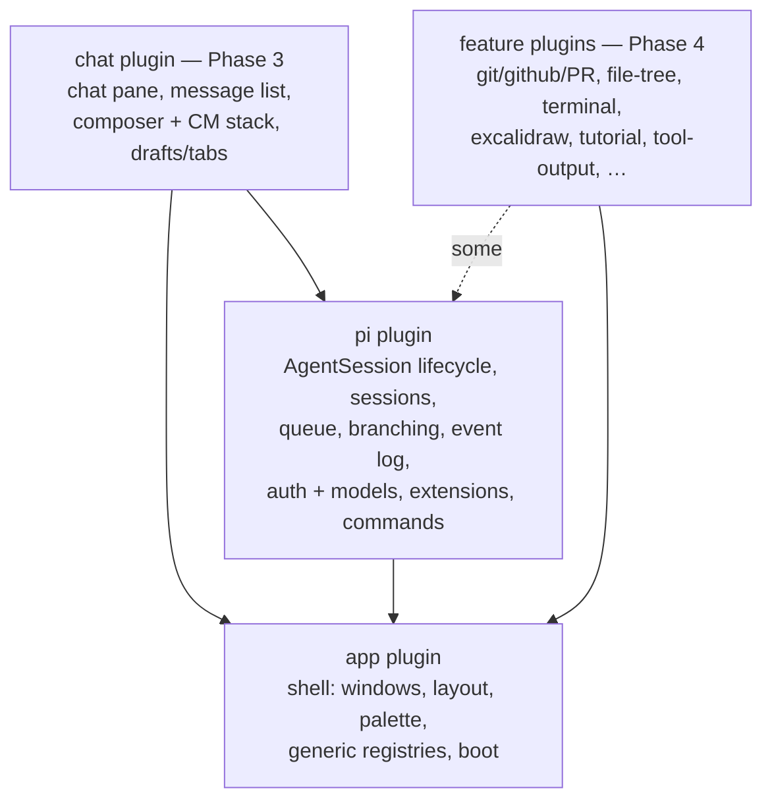

# App Plugin Decomposition

## Goal

Shrink `plugins/app` to a minimal shell (windows, layout, palette, generic
registries, boot) and give everything else a real owner. `plugins/pi` becomes
the actual Pi plugin — owning live `AgentSession` lifecycle, sessions, queue,
branching, event log, auth, and the model registry — instead of the thin
metadata registry it is today. Chat/composer UI extracts to its own plugin
after that. Feature views peel off opportunistically.

This finishes (and partially reverses) the 2026-06-05 pi-plugin-boundary
refactor, which created the right plugin but left the runtime behind a
stringly seam. Several artifacts of that half-state are live bugs today and
are fixed first, in Phase 0.

## Finalized Decisions (2026-06-11)

- **Sessions live inside `plugins/pi`.** Pi is the only runtime; the session
  machinery (steer/followUp queue shadow, SessionManager branching, event
  compaction) is thoroughly Pi-shaped. No runtime-agnostic "agent" layer —
  if a second runtime ever becomes real, extract the interface then, from
  two concrete implementations.
- **Chat/composer UI becomes its own plugin in Phase 3**, not part of `pi`
  and not left in `app`. It is the advice target for `cm-vim`, `cm-markdown`,
  `cm-image-paste`, `skill-pills`, and `pi-commands`, so it needs a stable
  identity — but it only moves after sessions settle and after zenbu.js
  supports stable advice target IDs.
- **Breaking renames happen in lockstep, tracked in `BREAKING.md`.** All
  consumers are first-party. Each move migrates every consumer in the same
  commit; no forwarding shims. Installed plugin copies under
  `~/.zenbu/plugins/` are updated as part of the same phase.
- **Three zenbu.js framework changes are in scope** (separate workstream in
  `~/Developer/zenbu.js`): advice error boundaries, missing-dep diagnostics,
  stable advice target IDs.
- **The chats/sessions ownership line is confirmed:** session records, queue,
  and event log → `pi`; chat tabs and drafts → the chat surface (app now,
  `chat` plugin in Phase 3). Interleaved fields like `queueDraft` get decided
  item-by-item against this line during Commit 2.1.
- **`pi-auto-commands` stays a user-installed plugin** (`~/.zenbu/plugins/`),
  positioned as a future marketplace install for users with custom Pi
  interfaces — not bundled first-party. Footprint QA before any exposure
  (see Commit 0.2).
- **Commit 0.4 (private-API reach-in) is deferred** — no unnecessary risk
  during stabilization; revisit after Phase 2.
- **Path-based extensions confirmed as the doctrine** (2026-06-11): all Pi
  extension contributions are files on disk registered in
  `root.pi.extensions`; the zenbu↔extension back-channel is the shared event
  bus, hardened with a typed protocol module (Commit 1.1). Everything we'll
  need is expected to be serializable; in-memory factories stay off the table.

## Target ownership

`app` keeps the workspace/scope/repo model for now (everything reads it);
extracting it to a `workspaces` plugin is a possible Phase 5, not scheduled.

---

## Phase 0 — Stabilize (no architecture changes)

These are the suspected causes of the intermittent "can't interact with the
IDE" breakage. Each is its own commit; verify interactivity after each.

### Commit 0.1 — Delete the orphaned Pi extension registry

- [ ] Delete `plugins/app/src/main/services/pi-extension-registry.ts`. It was
      marked deleted in the 2026-06-05 plan (Commit 5) but still exists, is
      still glob-loaded as a live service, and writes
      `root.app.piExtensions = {}` on every evaluate — a key that **was**
      removed from the app schema. Nothing depends on the `piExtensionRegistry`
      service key anymore (verified by grep; only stale generated types refer
      to it).
- [ ] Re-run `zen link` so dependent plugins' `.zenbu/types/deps/app/`
      regenerate without the dead service.
- [ ] Typecheck.

### Commit 0.2 — Collapse the duplicated pi-auto-commands plugin

Two diverged copies exist. The **loaded** one (per `zenbu.plugins.local.jsonc`)
is `~/.zenbu/plugins/pi-auto-commands`; the workspace copy at
`plugins/pi-auto-commands` has uncommitted improvements (extension hint
labels resolved against `root.pi.extensions`) that are therefore not running.

- [ ] Make the **user-install copy canonical**
      (`~/.zenbu/plugins/pi-auto-commands`, the one actually loaded).
      Direction: this stays an installable plugin — eventually an easy
      marketplace install for users with custom Pi interfaces — not a
      first-party bundled one.
- [ ] Port the uncommitted workspace improvements (extension hint labels
      resolved against `root.pi.extensions`) over to the user-install copy,
      then delete `apps/zenbu/plugins/pi-auto-commands/` from the workspace.
- [ ] QA the plugin's footprint so it doesn't pull in more than it needs
      before any marketplace exposure:
      - `zenbu.plugin.ts` `dependsOn` uses machine-specific absolute paths
        (`from: "/Users/daniel/.zenbu/apps/zenbu/zenbu.config.ts"`) — needs a
        portable resolution story.
      - `import type … from "../../../pi/src/main/services/pi-runtime"` reaches
        across install locations; route through generated dep types.
      - Audit which `root.app.*` / `root.pi.*` keys and service string-keys
        (`slashCommands`, `sessions`, `piRuntime`) it touches; that set is its
        de-facto contract with the host — keep it minimal and document it.
- [ ] Delete the dead advice module
      `src/content/runtime-command-composer-advice.tsx` (no `advise()` call
      registers it anymore; the slash-registry mirror in the service is the
      live path) — or re-wire it deliberately if the advice path is preferred.
      Do not keep both.

### Commit 0.3 — Guard renderer DB reads in plugin UI code

- [ ] Audit every `useDb` / `readRoot()` access in `pi-auto-commands`,
      `pi-commands`, `pi-footer`, `skill-pills` for unguarded section reads
      (`Object.values(root.pi.runtimeCommands)` with no `?? {}`,
      `root.app.chats[id]` with no optional chaining). A missing section
      during migration/hot-reload currently throws inside composer advice and
      bricks the composer.
- [ ] This is belt-and-suspenders; the real fix is the advice error boundary
      in the zenbu.js workstream below.

### ~~Commit 0.4~~ — Pi private-API reach-in (DEFERRED 2026-06-11)

`readPiRuntimeCommands()` in `plugins/app/src/main/services/sessions.ts`
falls back to `pi._extensionRunner?.runtime?.getCommands` — private SDK
internals. **Deferred: it works today, and the host-side sync exists because
the extension-only path was unreliable (see 2026-06-05 notes). Don't take
unnecessary risk during stabilization.** Revisit after Phase 2, when sessions
and `PiRuntimeService` are co-located and the right fix is likely a public
accessor in the Pi SDK rather than deleting the fallback. Pin a note to
re-check this on every Pi version bump until then.

### Phase 0 verification

- [ ] `pnpm run typecheck` and `pnpm run lint`.
- [ ] New chat session starts; prompt/steer/follow-up work.
- [ ] Slash menu opens, runtime commands listed with hints, dispatch works.
- [ ] `/reload` works; plan tool registers.
- [ ] Soak: no composer lockups across several hot reloads and session
      switches.

---

## Phase Z — zenbu.js hardening (parallel workstream, `~/Developer/zenbu.js`)

Do Z.1 and Z.2 early — they convert the current failure modes from
"mysterious frozen IDE" into visible, attributable errors. Z.3 is a hard
prerequisite for Phase 3.

### Z.1 — Advice error boundaries

- [ ] Wrap advised component renders (and content-script mounts) in an error
      boundary. On throw: render the **original** component, log the advising
      plugin + module path, and surface a dev-mode banner/toast naming the
      offender.
- [ ] A plugin bug must degrade the enhancement, never the host surface.

### Z.2 — Missing-dep diagnostics

- [ ] When a string-key service dep never resolves (slot stays `blocked`),
      emit a loud, visible warning listing the blocked service and the missing
      key — dev overlay and log, not just a silent stall.
- [ ] Same for `runtime.get({ key })` subscriptions that never fire with an
      instance within a grace period in dev. This exact silent no-op already
      bit the 2026-06-05 refactor (see its progress note about
      `ctx.piRuntime` being unavailable).

### Z.3 — Stable advice target IDs

- [ ] Let components register a stable advice ID; let `advise()` target
      `{ id }` as the preferred form, keeping `moduleId` suffix matching as a
      fallback.
- [ ] Motivation: Phase 3 moves `components/composer/**` and
      `components/chat/**` to a new plugin, which changes every module path —
      without stable IDs that silently breaks every composer-advising plugin.
- [ ] Release as `@zenbujs/core` 0.4.x/0.5.0; bump the app's dependency before
      Phase 3 begins.

---

## Phase 1 — `pi` absorbs the small Pi-owned pieces

### Commit 1.1 — Built-in extensions move to `plugins/pi`

- [ ] Move `plugins/app/src/main/pi-extensions/{bash-timeout,zenbu-house-rules}.ts`
      (and `lib/extra-dirs.ts` if it goes with them) into
      `plugins/pi/src/extension/`, registered via
      `piRuntime.registerExtension({ source: "built-in" })` as path-based
      extensions — same mechanism as `runtime-command-sync`.
- [ ] Conversion verified cheap (2026-06-11): neither factory actually uses
      the closed-over `cwd` (`zenbu-house-rules` takes `_cwd` unused and
      resolves the Zenbu root from `ZENBU_CONFIG_PATH`; `bash-timeout` reads
      env vars only), and Pi hands path-based extensions `ctx.cwd` natively.
      The "closing over the session cwd is important" comment in
      `pi-extensions/index.ts` is stale — delete it with the file.
- [ ] Delete `createAppPiExtensionFactories` and the `extensionFactories`
      argument in `sessions/activation.ts`. All contributions are path-based
      after this.
- [ ] This was already TODO'd in activation.ts (`TODO(pi-plugin-boundary)`).
- [ ] Add a **shared event-bus protocol module** at
      `plugins/pi/src/protocol.ts`: channel-name constants + zod payload
      schemas for every zenbu↔extension channel (starting with
      `zenbu-pi:runtime-commands`), imported by both the service side
      (`PiRuntimeService`) and the extension files. Replaces hand-rolled
      guards like `isRuntimeCommandsPayload()` duplicated per side. Plugins
      contributing extensions that talk back to zenbu import their channel
      schemas from here (or follow the same pattern in their own plugin for
      private channels).

### Commit 1.2 — Pi event log moves to `plugins/pi`

- [ ] Move `services/pi-event-log.ts` and `renderer/views/pi-event-log/` into
      `plugins/pi`, registered through the view registry like other plugin
      views. Move its icon out of `app/zenbu.plugin.ts`.
- [ ] BREAKING.md: view type / RPC namespace change if any consumer references
      it.

### Commit 1.3 — Rationalize the Pi UX plugins

- [ ] Decide and document the lane split: `pi` = runtime + state,
      `pi-commands` = session-control UX (tree/fork selectors, settings
      section), `pi-auto-commands` = runtime-command projection, kept
      **standalone as a user-installable plugin** (marketplace candidate for
      custom Pi interfaces — decided 2026-06-11, do not merge into
      `pi-commands`).

---

## Phase 2 — Sessions + auth move into `plugins/pi` (the payload)

Auth and sessions move **together**: `SessionsService` consumes the live
`AuthStorage`/`ModelRegistry` object handles via `ctx.auth`, and those can't
cross an RPC boundary. Moving them separately would force a temporary
handle-passing seam — exactly the pattern this plan exists to delete.

### Commit 2.1 — Move the code

- [ ] Move into `plugins/pi/src/main/`:
      `services/sessions.ts`, `services/sessions/**` (activation, live-session,
      branching, queue, event-log, event-log-payloads, scope-moves, labels,
      killed-markers, stats, pi-utils, types), `services/auth.ts`,
      `services/session-activity.ts`.
- [ ] Move schema sections from `app` to `pi`: `sessions`, `eventLog`
      collections, `providerStatuses`, `oauthFlow`. **`chats` (tab/draft
      state) stays in `app`** — it belongs to the chat surface and moves in
      Phase 3.
- [ ] `pi` plugin declares `dependsOn: app` (type-only) for reading
      `root.app.scopes` / workspace model; sessions keep reading scopes
      directly from the shared db, same as today.

### Commit 2.2 — Data migration

- [ ] kyju migrations are per-plugin-section, so the cross-plugin data move
      needs a backfill: on `pi` plugin first evaluate at the new version, copy
      any leftover `root.app.sessions` / auth-status rows into `root.pi.*`,
      then the app migration removes the old keys. Event-log collections:
      verify whether collection refs can be re-pointed or must be copied —
      **do not lose chat history**; test on a copy of the real db first.
- [ ] If this gets ugly, add "cross-plugin schema move" support to the
      zenbu.js workstream rather than hand-rolling twice (chats move again in
      Phase 3).

### Commit 2.3 — Lockstep rename of all consumers

- [ ] `rpc.app.sessions.*` → `rpc.pi.sessions.*`, `rpc.app.auth.*` →
      `rpc.pi.auth.*`, `root.app.sessions` → `root.pi.sessions`, events
      (`agentCompletedUnviewed`, …) re-namespaced.
- [ ] Migrate every consumer in the same change. Known consumers (re-grep at
      implementation time): app renderer (chat, composer, hooks, sidebar
      selectors, auth components), `agent-sidebar`, `pi-footer`,
      `pi-commands`, `pi-auto-commands`, `search-recent-agents`,
      `commit-button`, `context-sidebar`, `open-in`, plus installed copies
      under `~/.zenbu/plugins/` (`organized-plugins`, `research-tool-row`,
      `code-rendering` — check each).
- [ ] Record every rename in `BREAKING.md` (create it at repo root with this
      commit).

### Commit 2.4 — Delete the seam

- [ ] Delete the soft `runtime.get({ key: "piRuntime" })` plumbing, the
      `PiRuntimeApi` casts in consumers, and `getSessionConfig`'s
      extension-path/event-bus handoff — activation now lives next to
      `PiRuntimeService` and calls it directly.
- [ ] Auth renderer components (`components/auth/**`, OAuth modal) stay
      mounted by the app shell for now but call `rpc.pi.auth.*`; they move
      with chat in Phase 3 or get injected by `pi` via content script —
      decide then.

### Phase 2 verification

- [ ] Full manual pass: new session, prompt, steer, follow-up, queue panel,
      fork/branch, scope move, kill/restart recovery, model picker, OAuth
      login flow, provider status panel.
- [ ] Existing sessions from before the migration open with full history.
- [ ] `zen link` regenerated types everywhere; typecheck + lint green.

---

## Phase 3 — Extract the chat plugin

Prerequisite: Z.3 (stable advice IDs) shipped and adopted.

- [ ] First, **in place**: assign stable advice IDs to the composer/chat
      components that other plugins advise; migrate `cm-vim`, `cm-markdown`,
      `cm-image-paste`, `skill-pills`, `pi-commands` advice registrations to
      target IDs. This commit has zero file moves and de-risks the rest.
- [ ] Create `plugins/chat`: move `renderer/components/chat/**`,
      `renderer/components/composer/**`, chat-related hooks
      (`use-chat-draft`, auto-scroll, windowed items), the `chats` schema
      section + drafts, and the chat-window view wiring.
- [ ] App keeps: generic slash-command + palette registries, pane/tab frame.
      Chat plugin registers its view into the shell like any other plugin.
- [ ] BREAKING.md: `root.app.chats` → `root.chat.*`, advice module paths
      (mitigated by IDs), any `rpc.app` chat-adjacent methods.

## Phase 4 — Feature views peel off (opportunistic, no schedule)

Each is its own small project; do them as the area gets touched. Some merge
into existing sibling plugins instead of becoming new ones.

- [ ] git/github/PR stack (`github.ts` 1.3K, `pr.ts`, `git.ts`,
      `git-handoff.ts`, `views/pr`, `views/pull-requests`, `views/git-diff`)
- [ ] terminal (merge with `plugins/terminal`)
- [ ] file-tree (merge with `plugins/file-tree-sidebar`)
- [ ] excalidraw, tutorial, tool-output, playground, repos/recent-projects
- [ ] create-app / create-plugin / plugin-registry-mirror (merge into
      `plugins/plugin-dev` / `plugins/plugins`)

## Non-goals

- No runtime-abstraction "AI wrapper" layer; Pi is the runtime.
- No second Pi RPC process; no in-memory extension factories (path-based
  contributions only, per the 2026-06-05 decision — now actually enforced by
  deleting the last factory in Commit 1.1).
- No `workspaces` model extraction yet (possible Phase 5).
- No compatibility shims for renamed RPC/schema; lockstep + BREAKING.md.

## Risks / watch items

- Event-log collections are the largest data-migration hazard (Commit 2.2);
  rehearse on a db copy.
- Advice targeting by module-path suffix means **any** file move can silently
  break an advising plugin until Z.3 lands — between now and then, treat
  renderer file moves in advised areas as breaking changes.
- `zenbu.plugins.local.jsonc` loads plugins from `~/.zenbu/plugins` that
  duplicate workspace dirs; after Phase 0 keep exactly one copy of each
  first-party plugin and re-check this file whenever a phase moves code.
